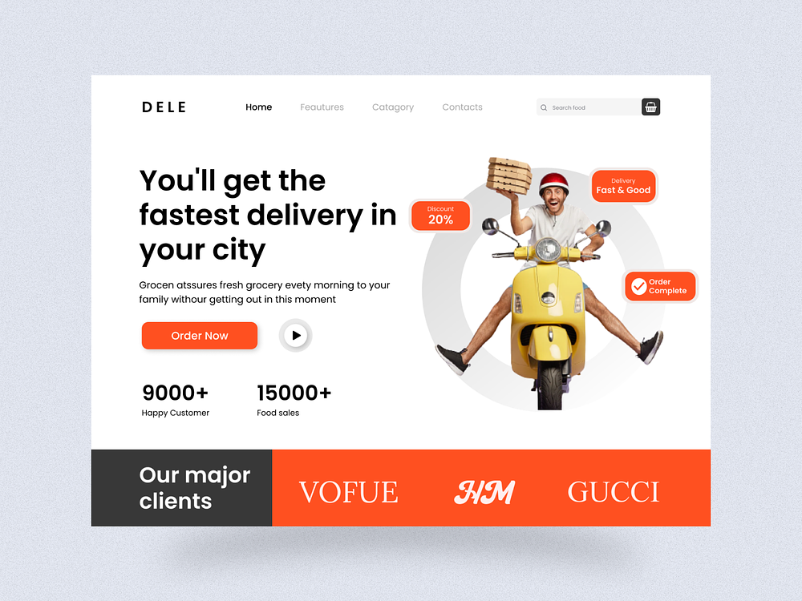

> fuul stack food delivery app using reactjs
> [follow me] [https://github.com/ZAHRAMESSI]

# To check the node version

'''
node --version
'''

# To the initialize the firebase console

'''
firebase init
'''

# To start the server

'''
npm run server
'''

# To create react project usin npm & yarn

'''
npm create-react-app folder-name
'''

'''
yarn create-react-app folder-name
'''

# To start the client

'''
yarn start
'''

> package used

<!--prettier-ignore -->
| Name         |  Links | Description|
|--------------|--------|------------|
|ReactJs       |[React](http://reactjs.org) | React is a free and open-source front-end Javascript library for buldin user  interfaces base on ui components.
|Tailwind CSS | [TailwindCSS](http://tailwindcss.com/) Tailwind CSS is a framework like no other . Rather than constrainting you  to a set design , it gives you the tools and the standardization to build exactly what you want.|
| Firebase Function | [Functions](http://firebase.google.com/docs/functions) | Cloud Functions for Firebase is a serverless framework that lets you automatically run backend code in response to events triggered by firebase features. |
|Express            | [Express](http://expressjs.com/)|Express.js ,or simply Express , is a backend web app framework  for node.js realese as free and open-source software under the MIT License . It is designed for building web  app and APIs.
|React Router Dom|[ReactRouterDom](http://reactrouter.com/en/main)|React Router DOM is an npm package that enables you to implement dynamic routing in a web app.It allows you to display pages and allow users to navigate them.|
|frame Motion    |[FrameMothion](http://www.framer.com/motion/) | A production-ready motion library for react .utlize the power behind framer , the best prototyping tool for teams.proudly open source. |
|React Icons     | [ReactIcon](http://react-icons.github.io/react-icons/)|All popular Icons in single package. |
